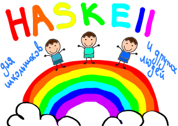

# Haskell для школьников и других людей

Это - концептуальная (WIP) книга про Haskell на русском языке, построенная на следующих принципах:

- На русском, но с английскими терминами
- Математический смысл: from first principles
- Много примеров
- Задорные картинки
- Разбирать синтаксис
- Плавный переход к зависимым типам (Idris) и формальной верификации (Liquid Haskell, Isabell, Coq)

Пока что не написано до конца ни одной главы, но мы работаем над этим.
